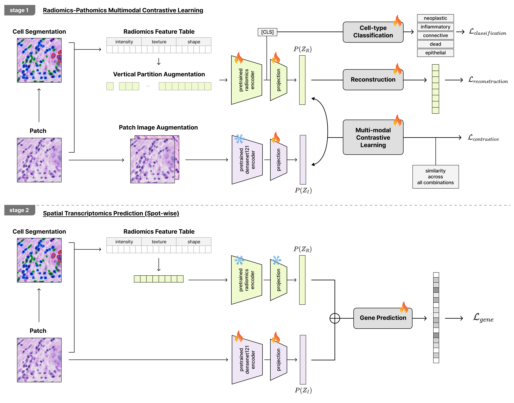

# RaPaCL-ST
RadiomicsFeature-Pathomics Contrastive Learning for Spatial Transcriptomics prediction. 

<p align="justify">
<b>RaPaCL-ST (RadiomicsFeature-Pathomics Contrastive Learning for Spatial Transcriptomics prediction)</b> is a multimodal representation learning framework designed to bridge handcrafted radiomics features and deep pathomics features derived from histopathology images, which aim to predict spatial gene expression value in patch-wise level. In this approach, radiomics features extracted from image patches serve as structured, interpretable signals, while deep learning based patch image encoders encode high-dimensional visual representations. RaPaCL leverages contrastive learning to align these two modalities in a shared latent space, encouraging consistency between radiomics-informed characteristics (e.g., texture, heterogeneity) and deep image embeddings. By doing so, the framework aims to enhance the biological relevance and interpretability of learned representations, ultimately improving downstream tasks such as spatial gene expression prediction and tumor characterization in whole-slide images. 
</p> 


---

## Architecture 

<p align="justify">
RaPaCL-ST is a two-stage multimodal learning framework that integrates handcrafted radiomics features with deep pathomics representations for spatial transcriptomics prediction. 
</p> 



<p align="justify">
In Stage 1, radiomics features extracted from cell-segmented histopathology patches are encoded using a radiomics encoder, while patch images are processed through a deep pathomics encoder. The framework then aligns the two modalities in a shared latent space using multi-modal contrastive learning. To further preserve biologically meaningful information, auxiliary objectives including radiomics reconstruction and cell-type classification are jointly optimized. This stage encourages the image encoder to capture interpretable tissue characteristics such as texture heterogeneity, morphology, and structural organization.
</p> 

<p align="justify">
In Stage 2, the pretrained multimodal representations are utilized for downstream spatial gene expression prediction. The latent embeddings from the radiomics and pathomics branches are fused and passed to a gene prediction head, which predicts spot-wise gene expression profiles. By incorporating radiomics-informed supervision into the representation learning process, RaPaCL-ST aims to improve both predictive performance and biological interpretability compared to conventional image-only approaches.
</p> 

---

## Description 

### Prepare Data & Run Baselines

Please refer to: `dataset/README.md` and `baselines/README.md`. 

### Run RaPaCL

```bash
python -m rapacl.run  # single gpu
torchrun --nproc_per_node=2 -m rapacl.run  # multi gpu 
OMP_NUM_THREADS=4 torchrun --nproc_per_node=2 -m rapacl.run  # multi gpu multi thread 
OMP_NUM_THREADS=4 torchrun --nproc_per_node=2 -m rapacl.run 2>&1 | tee log.log  # saving log file 
```

For configuration, check `rapacl/configs/`. 

---

