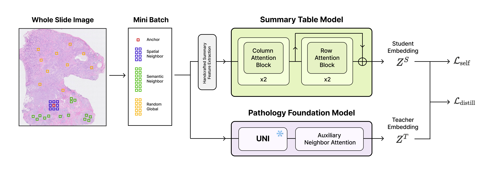

# STaRN

**Summary Table Representation Learning with Neighborhood Distillation**

<p align="justify">
STaRN is a representation learning framework for learning radiomics-based handcrafted summary representations of spatial transcriptomics (ST) spots. The core idea is to treat each training batch as a <em>Summary Table</em> — rows are spots (anchor + spatial ・ semantic neighbours + random globals), columns are handcrafted features — and apply a SAINT-style dual-attention encoder that models both within-spot feature interactions (column attention) and cross-spot neighbourhood context (row attention). Student representations are distilled from a frozen UNI pathology foundation model, while self-contrastive learning encourages neighborhood-aware and feature-consistent representations. 
</p>

---

## Overview



---

## Installation

```bash
conda create -n starn python=3.10
conda activate starn
```

Install PyTorch matching your CUDA version:

```bash
pip install torch torchvision torchaudio --index-url https://download.pytorch.org/whl/cu121
```

Install remaining dependencies:

```bash
pip install timm h5py scanpy scikit-learn
```

---

## Run

**1. Extract UNI embeddings** (once, before training)

```bash
python .test/extract_uni.py
```

**2. Edit config** — set `data_root`, `sample_ids`, and hyperparameters in `configs/config.py`.

**3. Train**

```bash
python train.py
```
